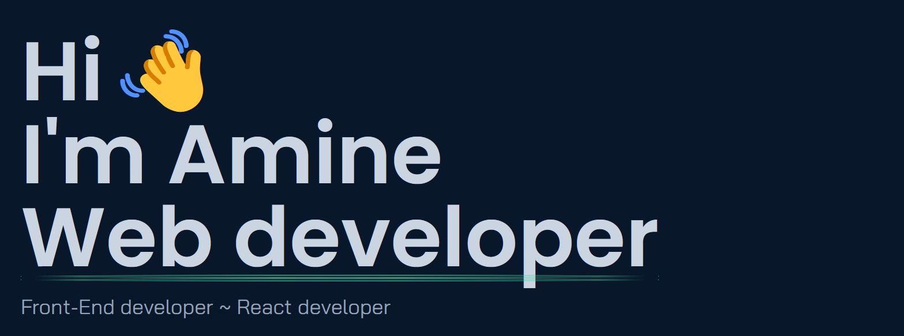

   

 

Hi 👋, I am **Amine Elkhalidy**, a **FrontEnd web developer** with almost two years of professional experience through freelancing on popular freelancing platforms as *Upwork, Freelancer, Fiver, etc...*   
I am interested in **web technologies** and I really *enjoy* when it comes to learn something new, like a new *language, library or framework...*   
I am seeking to take my skills to the next level by working on *real world projects*.   

- 👨‍💻 All of my projects are available at: [**amineelkhalidy.vercel.app**](amineelkhalidy.vercel.app)   
> I am opened to freelancing or working remotly opportunities...   

### My services:  
✔️ PSD to HTML
✔️ Front web app   
✔️ Pixel Perfect design   
✔️ Responsive design   
✔️ Components & Layouts development   
✔️ Authentication   
✔️ API integration   
✔️ Database integration

### Frontend technologies I master:   
✔️ HTML5 & CSS3   
✔️ JavaScript   
✔️ Sass   
✔️ TailwindCss   
✔️ React.js   
✔️ Next.js   
✔️ TypeScript   
✔️ Styled components 

  

   

### Get in touch with me using:   
- Email: [a.amineelkhalidy@gmail.com](a.amineelkhalidy@gmail.com)
- Facebook: [https://www.facebook.com/amine.elkhalidy.73](https://www.facebook.com/amine.elkhalidy.73) 
- Upwork: [https://www.upwork.com/freelancers/~01f55a2d4b119d3119](https://www.upwork.com/freelancers/~01f55a2d4b119d3119)

   

   

